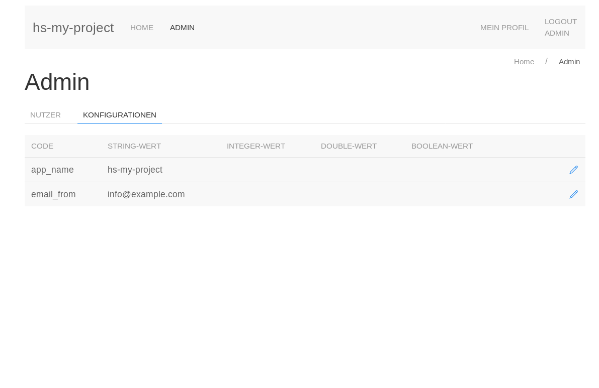

# hs-stack-templates
Some stack templates to easily start new projects

# List of templates:
1. yesod-riot-auth.hsfiles
   - yesod-postgres template
   - auth-hashdb
   - riot-js component-based UI library
   - UIkit front-end framework

see template and project details in the template subdirectories

# Sample Screenshot
Here is a screenshot of a yesod project rights after installation with stack.
As you see the default models are already generated


# Template installation
```
stack new my-project https://raw.githubusercontent.com/Greif-IT/hs-stack-templates/master/yesod-riot-auth.hsfiles
```
# .hsfile generation
```
$ sh join_hsfiles.sh yesod-riot-auth
```
